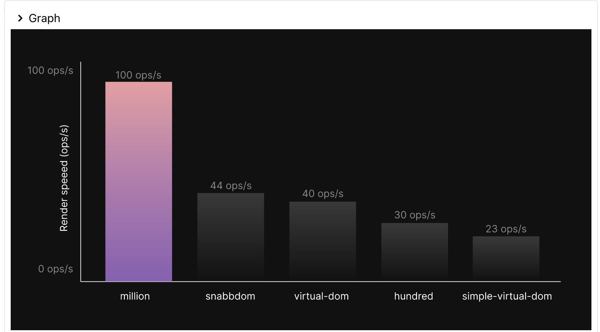
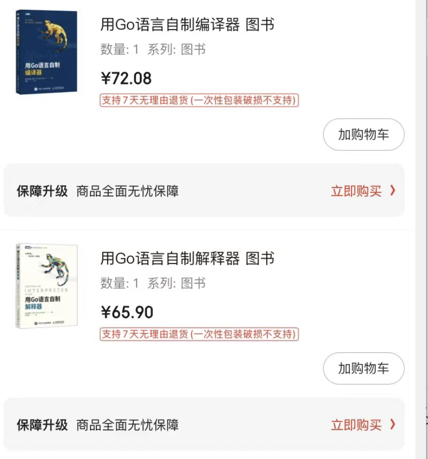
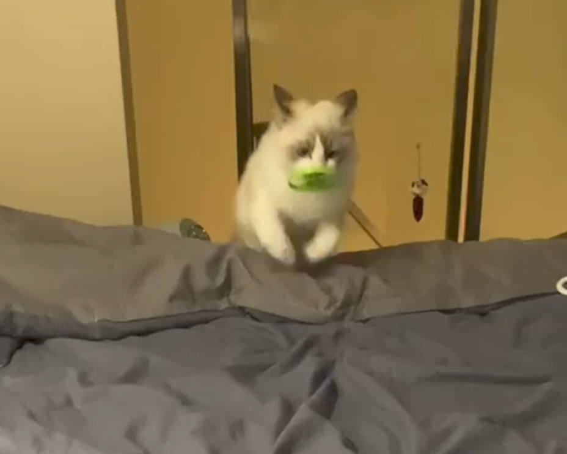

📮 订阅：https://rottenpen.zhubai.love/

最近有点不满足于被动吸收文章推送，同时想保持一点不需要命题的产出，就有了这一个周刊系列。希望朋友们也监督一下我，保持每周产出周刊，欠更晚更发红包好伐。

# 🙈 前端见闻
## 🧩 WebContainer
因为业务原因，跟公司 WEB IDE 的同学有了一些交流，了解到他们做的 WebContainer。真的是大开眼界。简单描述就是，通过 JS 在浏览器里实现了一个小型系统，提供了 node 所需的底层 api，让 node 可以在浏览器中跑起来。原来的架构需要维护 web 和 node 两个包，有了 WebContainer 就只需维护 node 包了。
https://zhuanlan.zhihu.com/p/446329929

## 🧩 million
一个轻量高性能的 vdom 库，有点类似于 vue3 的编译优化，在编译期生成 flag 跟 delta，来提高 dom diff 性能，某些 workbenchs case 性能可以达到 O(1) => 即和直接调用原生 dom 不用进行 vdom diff 的效果一致。

官网:https://millionjs.org/

论文:https://arxiv.org/abs/2202.08409v1

## 🧩 typscript 4.8 beta 版本发布了

https://devblogs.microsoft.com/typescript/announcing-typescript-4-8-beta/

## 🧩 Dan 针对 react 社区的批评做出了回应

https://www.reddit.com/r/reactjs/comments/vd0w6g/react_labs_what_weve_been_working_on_june_2022/ickr47j/

关于这个问题，我们也可以看看黄玄的回复 ：
https://www.zhihu.com/question/501745074/answer/2534494955

## 🧩 Umi 4.0 发布了 https://zhuanlan.zhihu.com/p/531657498

# 📦 资讯收集
## 🧩 copilot 开始收费了（10U/mouth, 100U/year, 学生和开源开发者免费）  
https://github.com/github-copilot/tp_signup

## 🧩 华为自研编程语言「仓颉」试用报名开启
https://www.zhihu.com/question/522496670/answer/2541267325

## 🧩 省钱小助手，300 多种流行的开源方案替代 SaaS 服务 
https://www.opensourcealternative.to/

## 🧩 从 keynote 大神到语雀画图大神
 https://www.yuque.com/yuque/blog/znor93

编者吐槽：在画图上飞书什么时候才能支棱起来！
## 🧩 Tauri 1.0 Release
https://tauri.app/blog/tauri_1_0/

## 🧩 Cloudflare 发生了一次服务故障事件，影响到 19 个数据中心的流量
https://blog.cloudflare.com/zh-cn/cloudflare-outage-on-june-21-2022-zh-cn/

## 🧩 三名哈佛辍学生打造的教程制作工具获得1400万美金
https://www.tango.us/

## 🧩 ？？？日常迷惑

# 🚴 生活
- 最近小徐老师请假在家写论文，每天早上拉我跳帕梅拉，强度确实比刘畊宏强多了
- 新买了猴书，进阶一下自己的编译基础（其实是想看懂 esbuild 的代码

- 家里的猫猫会叼飞盘了，猫界老胡莫属

# 👋最后
希望以后能保持周更吧，对齐一下 Saka https://www.manjusaka.blog/weekly

Reach me: 🛰️pen1005

下周五见！
