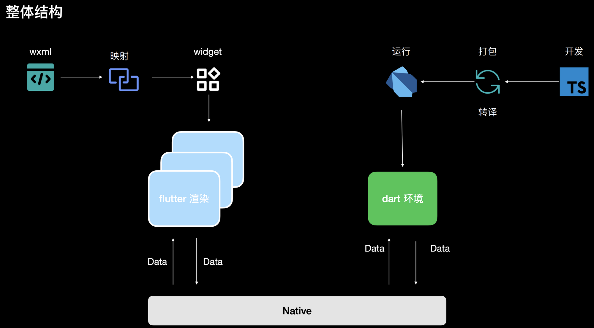
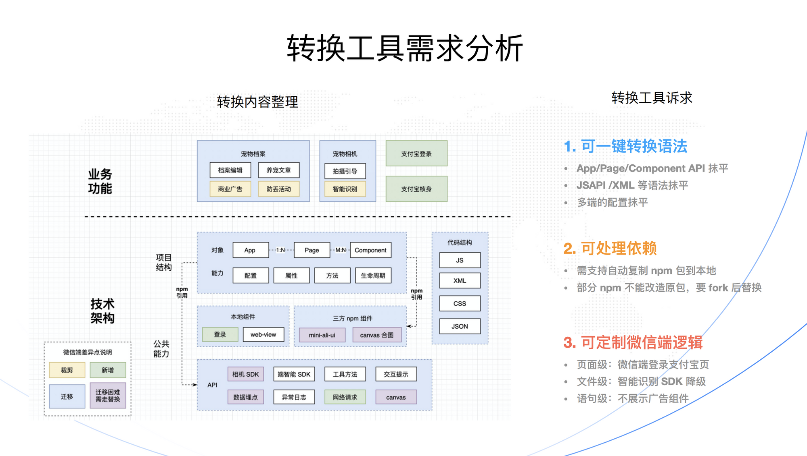
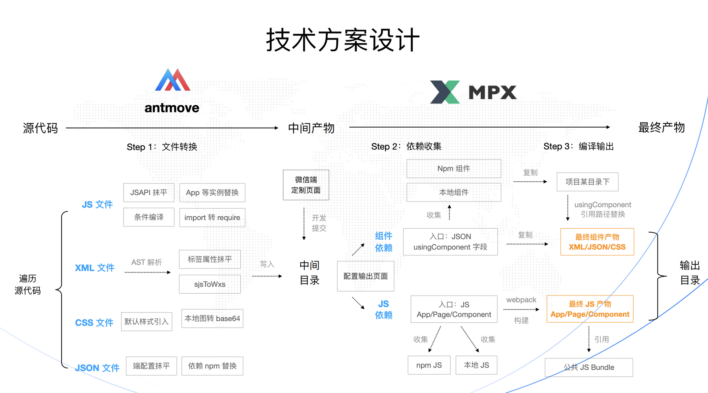
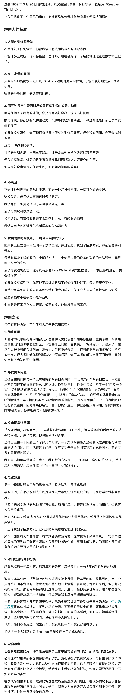

📮 订阅：https://rottenpen.zhubai.love/

# 🙈 前端见闻
## 🧩 早早聊笔记
周六早早聊做了一期跨端主题的分享，正好跟我的业务方向匹配，选了两个跟我业务有关的分享听了一下。

《如何使⽤ flutter 设计⼀个跨多端⼩程序》

这套架构本质上来说就是，开发者虽然表面上写 wxml 和 ts，但代码最终都会被转译成 flutter 代码。这个分享一开始我是听起来一脸懵的，分享人挂着有赞专家的头衔分享涂鸦智能做的项目，我就纳闷有赞哪里有这么多业务场景啊，ROI 很低吧？后面了解到原来是要做 IOT 的场景，才有点理解为什么要做一套这样的系统。不过可以预想的是，这种架构灵活性肯定很差，开发者开发得骚一点就会有问题，维护成本挺高的。

简单描述：

视图层，通过编译器把 wxml 映射成 flutter runtime 的 widget

逻辑层，同样通过编译器把 ts 转成了 dart 代码

《⽀付宝⼩程序跨端转换实践》

这个分享还挺有意思的，算是逆主流而行了，现在市面上的跨端框架都喜欢做一套 runtime 来磨平多端差异，光 runtime 就已经几百 k 了，这个方案回归本源只做转译，目的就是减少包体积，提高性能。如果不考虑开源，不考虑大而全，这个方案作为某些可控范围内项目的方案挺好的，转译过程中遇到什么问题也可以缺啥补啥。

## 🧩 TS 抽取组件描述
https://www.yuque.com/xiwen-bxuha/pr/ye33ct 

本文记录对 react 组件自动 d.ts 文件所用到的 react-docgen-typescript (以下简称 RDT ) 的源码分析，讲述了 RDT 的局限性及其原因，对 ts compiler 原理感兴趣的同学可以学习一下

## 🧩 基于 vite 做服务端开发
https://github.com/cyco130/vavite

## 🧩 写 react 的形式来写 canvas
https://github.com/konvajs/react-konva

## 🧩 流式渲染在 wkwebview 上有限制，会引起 bug
https://github.com/xiaoxiaojx/blog/issues/37

# 📦 资讯收集
## 🧩 15-5 大法
https://www.swyx.io/the-importance-of-writing-weekly-updates/

## 🧩《O11Y 杂志》是一份专注于可观测性领域的独立开源技术杂志
https://o11y.cn/about/

## 🧩《找到公司最聪明的技术人员，并让他们成为首席执行官》
https://shimo.im/docs/vVqRV16J9vFyLYqy/read

## 🧩 开课吧暴雷，预言家竟是我自己
https://www.zhihu.com/question/530347717/answer/2460592108

## 🧩 解题人的特质和解题之法
http://www1.ece.neu.edu/~naderi/Claude Shannon

## 🧩 ？？？日常迷惑

# 🚴 生活
## 🧩 上周末对象在肝论文，作为陪读也是呆家里哪里都没去，这周可以出去看展看演出咯。

## 🧩 sponsoring antfu

## 🧩 朋友亲戚投志愿想投计算机来找我咨询，发现一个比较有意思的点 —— 这个朋友是公务员，她第一反应是，投计算机有什么编制类型的就业，而我下意识想的是互联网的泡沫要没了。

> 虽然我觉得它不是一个很好的选择，但是该割还是得割【doge】

## 🧩 参加冴羽的学习训练营，结营了

# 👋最后
希望以后能保持周更吧，对齐一下 Saka https://manjusaka.zhubai.love/

Reach me: 🛰️pen1005

下周五见！

