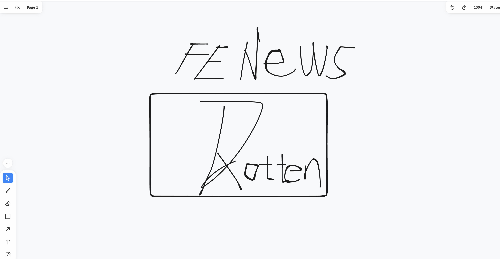

📮 订阅：https://rottenpen.zhubai.love/

这周整个人都处于高压锅状态，很多事情都到了收尾节点，没多少时间学习，所以这期非常短。

# 🙈 前端见闻 + 资讯收集
## 🧩 Taro
这周在部门内做了一次技术分享，讲了一下 《Taro 的原理和如何快速混 PR》。写这个分享的时候发现给 Taro 提 pr 难度跟 typo 没啥区别。就举个例子，Taro 只支持 120 个 api，而字节小程序有几百个 api 👀，同理在微信/支付宝/百度小程序这种 diff 肯定还很多，想混大型开源项目 pr ，参与共建的同学还不冲？

https://github.com/NervJS/taro

## 🧩 JS 润泰姆
> 标题来自不愿透露姓名的 Richard 网友

最近有种全世界都在做 JS runtime 的感觉（此处感谢煮阿姨带逛）。可以大概说一下它们的逻辑，在边缘计算节点运行函数，由于边缘节点并不需要那么多能力，阉割版的 runtime 可以跑的更快：

- 🚀 edge Runtime https://edge-runtime.vercel.app/
- 🚀 deno 官方出品的极简轻量博客
  - 🎉 https://github.com/denoland/deno_blog
  - 🎉 example: https://github.com/ry/tinyclouds
- 🚀 从 deno 的博文可以看出，他们也在卷 js runtime 的方向
  - 🎉 https://tinyclouds.org/javascript_containers
- 🚀 本周爆款 Bun https://github.com/Jarred-Sumner/bun
- 🚀 最后翻到 https://wintercg.org/ 原来我们公司也有参与…

## 🧩 JavaScript心智模型
https://github.com/sudongyuer/javascript-mental-models

## 🧩 白板会议方向的开源工具
https://github.com/tldraw/tldraw 

## 🧩 Rust 开发的 nodeJS 版本管理工具 
https://github.com/Schniz/fnm

## 🧩 vercel 赞助的 React 组件库，确实挺现代+好看 
https://nextui.org/

## 🧩 Early Hints (RFC8297 [1], HTTP 状态码 103) 可以方便浏览器在服务器正生成响应时预先加载一些需要的外部资源。目前 Chrome 103 起对此默认支持。

测试表明，Early Hints 在不同环境中对浏览体验相关数据（例如 FCP/LCP）有 7%-20% (p75) 或 2%-9% (p50) 的提升。Cloudflare 用户可在 Speed 页对自己的站点启用此功能。

https://blog.cloudflare.com/early-hints-performance/

## 🧩 长期主义与及时行乐 
> 间歇性发奋图强，持续性混吃等死

https://geekplux.zhubai.love/posts/2155892922556416000

## 🧩 恋爱也是坚持魔法术
> 浪漫且有效的自律手段

https://bodeng.zhubai.love/posts/2156652910715662336

# 🚴 生活
## 🧩 新买的卡片机到了，比手机轻，拍出来的效果很好，妹子很满意。至于拍出来的照片就不放了嘻嘻。

## 🧩 周末去看了演出，距离上一次看演出已经过去半年了

## 🧩 周日跟做 web3 的朋友喝了杯咖啡，第二天他就开始新疆的旅程，数字游民的生活充满诗意和肆意呀

# 👋最后
希望以后能保持周更吧，对齐一下 Saka https://manjusaka.zhubai.love/

Reach me: 🛰️pen1005

最后打个广告 23 届研发提前批已经开始了，可以找我内推呀，用我的码可帮看简历呢（虽然看我周刊的应该没多少在校生）

字节跳动校招内推码: 47WD81X 

投递链接: https://jobs.toutiao.com/s/YKs4sEt

下周五见！

致敬高桥和希老师，一路走好
