📮 订阅：https://rottenpen.zhubai.love/

嗨，朋友们，这里是 FE News 的第 5 期。因为最近太忙 + 这期的主题不太在我能力射程范围内，所以专门找了 Saka 老师给我补了一课。周五更的周刊终于是周五更新的了。

# 🙈 前端见闻

## 🧩 HTTP/3 和 QUIC

这一期主要来聊一下 HTTP/3 和 QUIC 的最新动态

> 经过 5 年的努力 HTTP/3 终于标准化为 RFC 9114 了
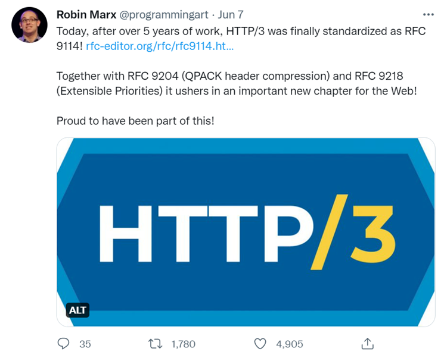

发现很多文章都没说好为什么 TCP 要三次握手而 QUIC 只需要一次。这里用尽量简短的话来描述一下。

首先握手是为了可靠，因为在 UDP 上传输的信息只能保证消息发出去了，不太能保证接收方能接收到，所以 TCP 才会进行三次握手。

其实并不是绝对的，14 年的时候 tcp 就推出了 TCP Fast Open 也可以做到一次握手了，网络传输的中间设备和操作系统如果没升级，就只能走老的 3rtt 方案了。
TFO 的原理是，客户端会存一个以前跟相应 ip 通信留下的 cookie（所以 TFO 是有一个大前提的，就是以前已经做过三次握手了），在 TFO 第一次握手的时候带上。有了这个 cookie，服务端可以确认这个客户端是可信的，服务端就直接给客户端推消息了，不需要等三次握手都完成。（注意，三次握手还是会继续进行，只是服务端在收到第一次握手的时候就开始发消息了，规避掉时延的问题）。

见下图 ⬇️
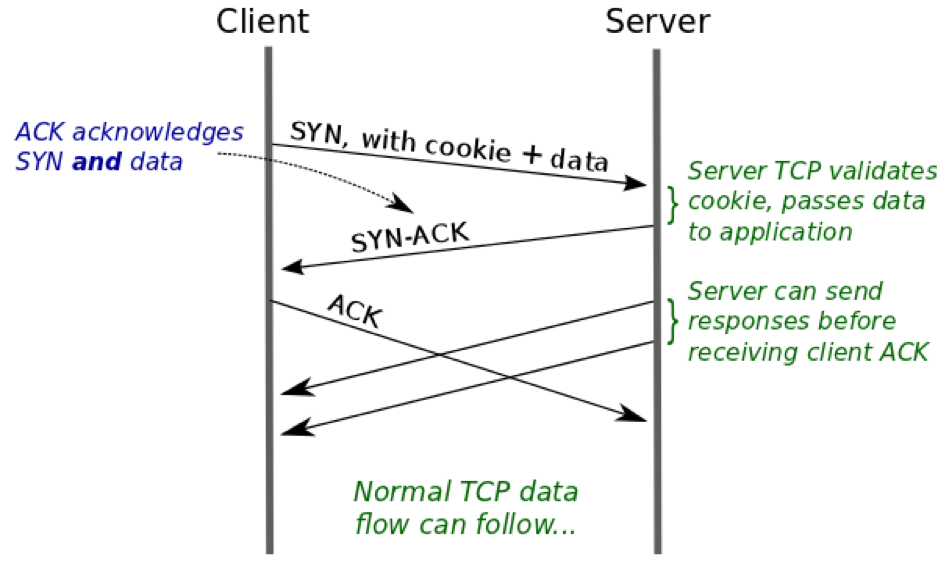

这种 1rtt 的形式相对来说肯定是没 3rtt 可靠的，因为服务端在不感知客户端是否收到自己发出 syn-ack 的情况下就开始传数据了。但是在现在网络基建逐步完善的时代，我们可以大胆地相信，网络是 ok 的，对方是能收到消息的。

同理 QUIC 也是在默认网络传输稳定情况下设计的 1rtt ，同时以重传的机制保证对方能收到传过去的消息。

> Saka 老师锐评：国内基建不行，这玩意暂时只能在内网里使用

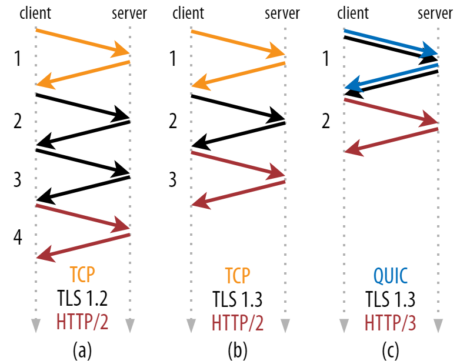
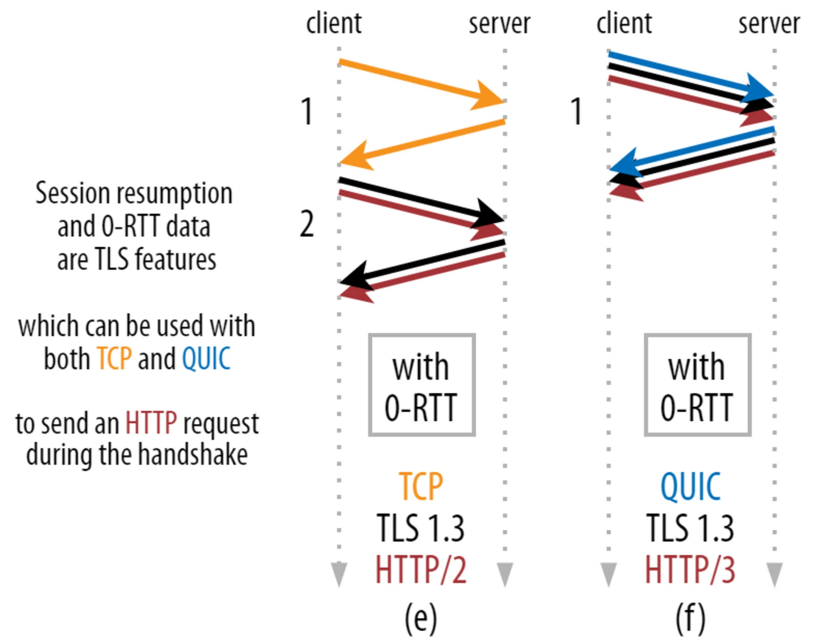

🚀 Saka 给我推荐的（突然反应过来前端社区写的 QUIC 主题的文章都是什么 💩）：https://www.sofastack.tech/blog/deeper-into-http/3-evolution-of-the-protocol-from-the-creation-and-closing-of-quic-links/

🚀 核心原理详解：
https://www.smashingmagazine.com/2021/08/http3-performance-improvements-part2/

🚀 对话 Robin Marx：HTTP/3 和 QUIC 将带来重大机遇和挑战： https://mp.weixin.qq.com/s/Ull2M4BsBTI8C3NS7Z2xYA

🚀 QUIC 和 HTTP/3 在 meta 的多个场景的应用，超过 75% 流量已经用上 HTTP/3 了https://engineering.fb.com/2022/07/06/networking-traffic/watch-metas-engineers-discuss-quic-and-tcp-innovations-for-our-network/

🚀 看了一下 Meta 开发者网确实有不少 h3 了，但 react beta docs 仍然没支持上~~（有没有一种可能，跑分跑不过 vue docs 就输在这了）~~

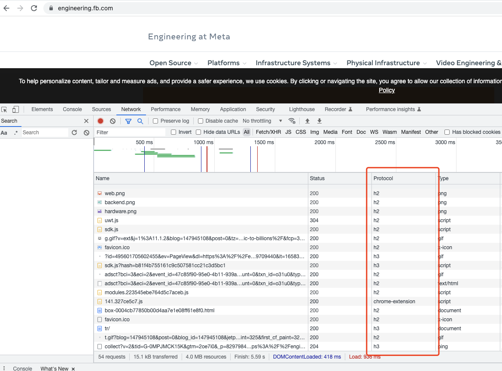

🚀 快手 quic 在直播场景的实践
https://www.infoq.cn/article/afncpsfmb3ufwehueak1

## 🧩 Deno 被 bun 激怒了，新版本 FFI 性能提升了 200 倍

https://deno.com/blog/v1.24

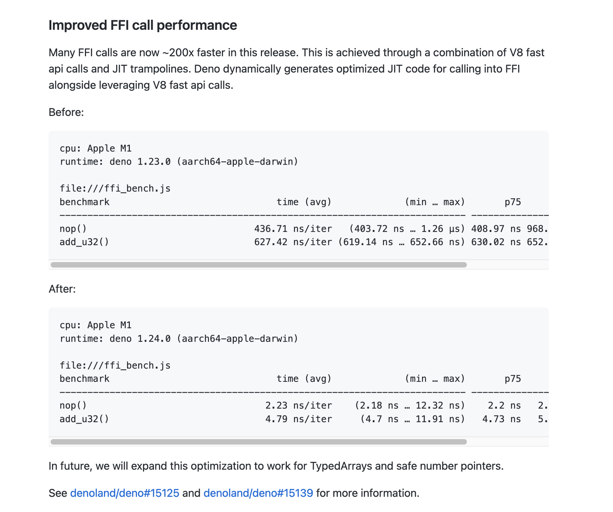

## 🧩 Remix vs Next

Remix 是一个 edge-first 的全栈框架，它和老字号 Next.js 有什么区别呢？

Remix 支持多种前端框架，Next 只支持 React
都支持 SSR，但是 Next 还支持更多的静态渲染 SSG / ISR / 新出的 On-Demand ISR
Remix 是基于 Web Fetch API 的，Next 需要使用 Edge Functions ，可见 Remix edge-first 的特点，而 Next 更偏向能力大而全。
https://www.smashingmagazine.com/2022/07/look-remix-differences-next/

## 🧩 用 wasm 在浏览器里跑操作系统

x86 的都能跑，就很炫酷 ⬇️
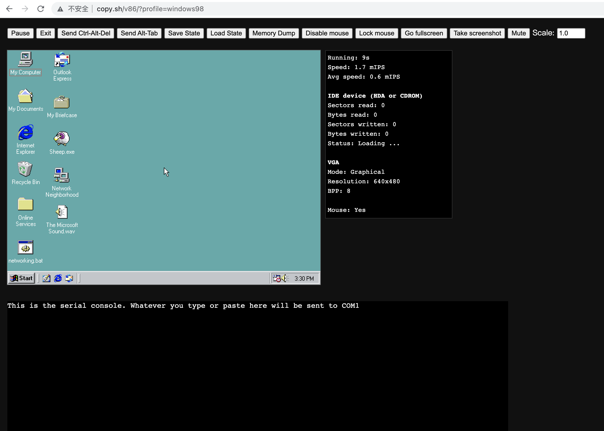
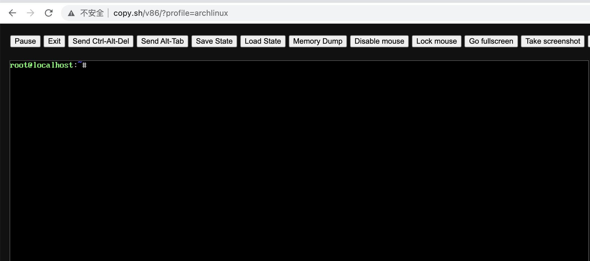

http://copy.sh/v86/

https://github.com/copy/v86

## 🧩 手写 vm

Write your Own Virtual Machine

https://www.jmeiners.com/lc3-vm/

## 🧩 Uber 如何做开发人员生产力工程

https://www.youtube.com/watch?app=desktop&v=zeNGbnmaoDc&feature=youtu.be

# 📦 资讯收集

## 🧩 聊聊产品决策

我见过很多成熟的产品经理总是以「我觉得」来开始他们的结论，却从来说不出背后的原因。
⬆️ 毕业第一年有遇到过这样的产品经理，真的是灾难现场。

本文讲的基本逻辑在技术岗同样适用：

逻辑完备，技术方案为什么要这样设计，ROI 的衡量，取舍和平衡

https://coffee.pmcaff.com/article/3450173938621568/pmcaff?utm_source=forum

## 🧩 分享焦虑
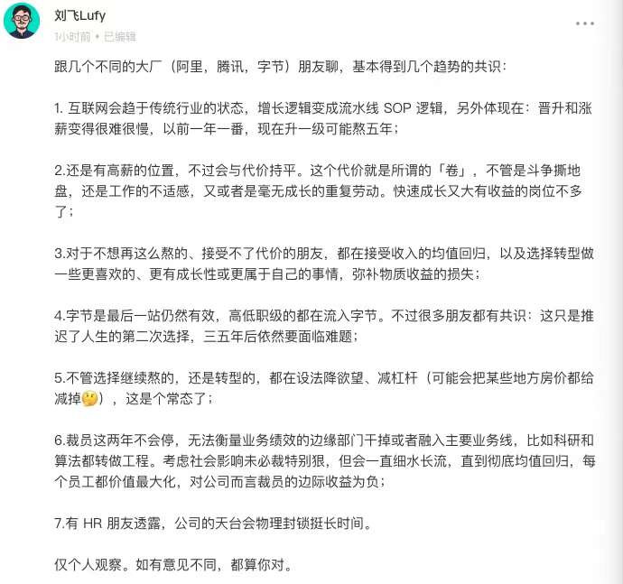

其实听三五环一年多，类似的观点已经听他讲好几次了，不过我对他说的 “选择转型做一些更喜欢，更有成长性或更属于自己的事情” 有了一些新的感受。

经常会听到朋友们说，不想做手里的事情或者想改变现状，但不知道自己到底喜欢什么，不知道有什么更好的选项。其实这个问题的核心是信息差，信息是需要积累的，这种积累可能是知识/技能，可能是人脉，可能是作品，而更深层次来说，我觉得是好奇心，保持嗅觉和求知欲才是发现自己喜欢什么的魔法术。

## 🧩 一家全球化初创公司背后的 30+ SaaS 服务和成本

> 省流版：
团队规模： 1.研发团队 10 多人，每两周发布一个新版本，每一次版本有 100 ~ 150 次的新提交。 2. 开发者市场团队 3 人，内容产出每周 3 ~ 5 篇，中英文都有。另外还有技术文档的日常更新。 3. 一名兼职的行政人事，处理除了研发和市场外的其他所有公司后台事务 (当然我们也请了外部的财务和法律顾问)。
月花销： $1183 换算成 RMB 是 8000，30+ 款大部分服务都可以白嫖。

https://mp.weixin.qq.com/s/eC9wvYladWevRZp8gc6a8Q

## 🧩 2022 年初创公司的 pitch deck（给 VC 演示的 ppt） 该怎么写

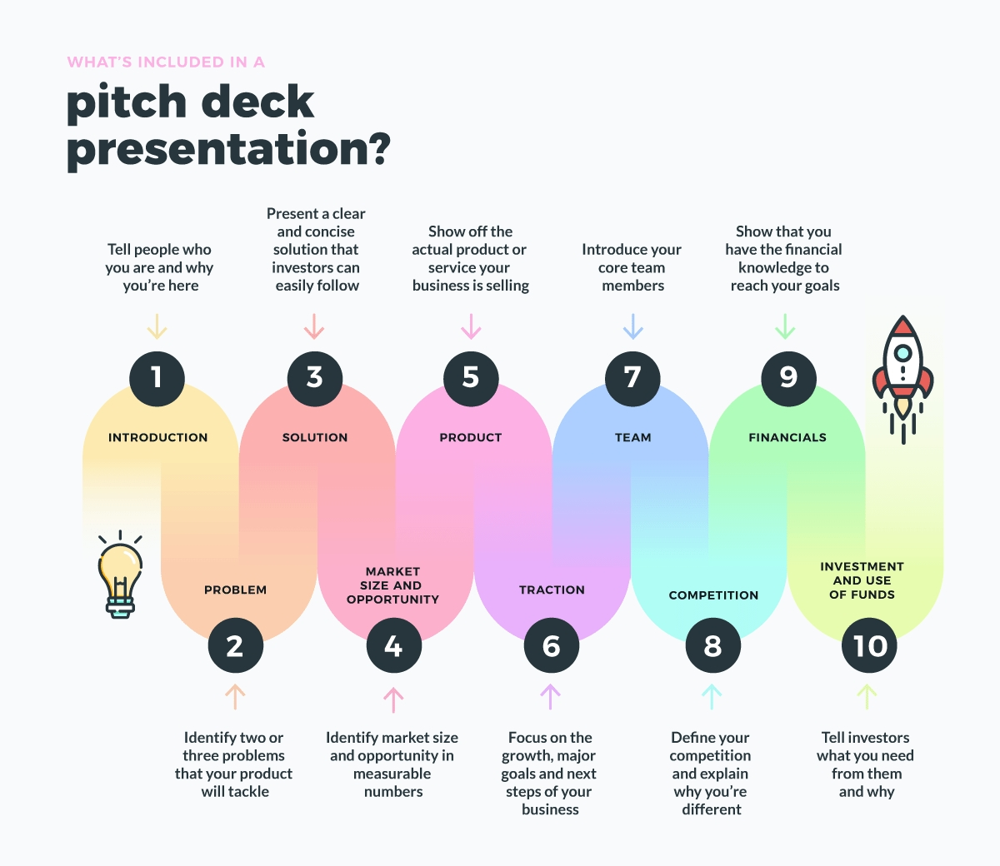

https://www.failory.com/blog/pitch-deck-guide

# 🚴 生活

## 🚀 我滴朋友回忆哥哥也开了竹白周刊了
https://retros.zhubai.love/
## 🚀 周末 Saka 在公益群里做了一次技术分享，关于 terraform。
后感：幸亏我不是做 SRE
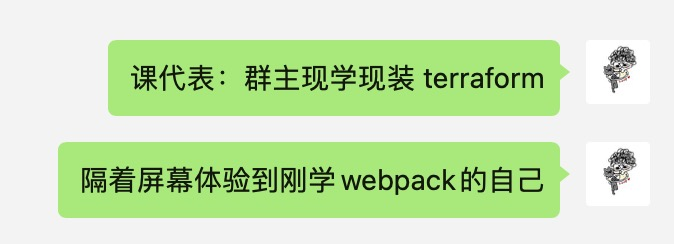

## 🚀 这周给 vuepress 和 swc 提了两个 typo 级别的 pr

# 👋 最后

希望以后能保持周更吧！

对齐一下 Saka https://manjusaka.zhubai.love/

还有半月刊回忆 https://retros.zhubai.love/

Reach me: 🛰️pen1005

下周五见！
