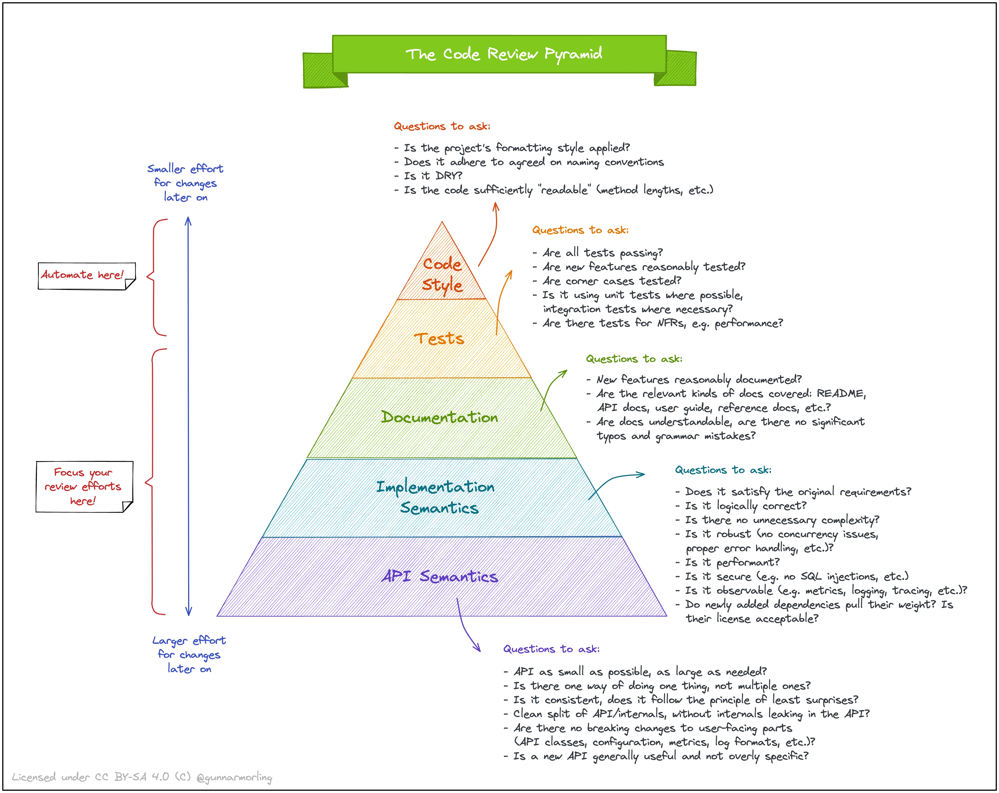
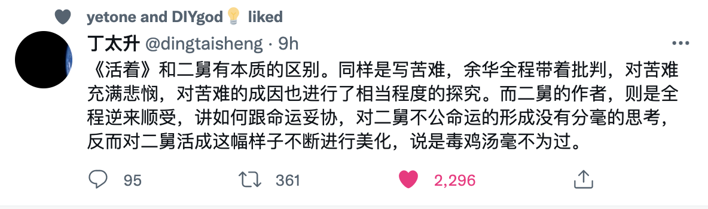

📮 订阅：https://rottenpen.zhubai.love/

嘿，朋友们，这里是 FE News 的第 6 期。这周是没啥主题的一周，不过这周收集到的资讯挺有意思的，容我摸一周（多图预警）。

# 🙈 前端见闻 
## 🧩 Async EventEmitter
今天遇了一个 bug，手里项目的生命周期是通过 node 官方的 eventEmitter 做事件发布的，但它只支持同步回调，订阅的事件是异步的，然后我就遇到时序问题了。希望能卡住生命周期，就找到了这个库，不过居然不支持回调（虽然也合理）。

https://github.com/sindresorhus/emittery

## 🧩 用 ts 的类型系统实现一个 ts 类型系统🪆

https://github.com/ronami/HypeScript

以前刷题群的同学经常喊引证老师表演一下用类型系统刷 leetcode，然而引证老师现在已经开始用汇编刷题了。引证老师，我滴超人！

## 🧩 又一个 rust-base 的新 JS 润泰姆
想了一下 node 称霸这么多年，除了 deno 之外，之前其实一直没有其他 JS runtime，直到最近才开始一个个涌现。我想主要还是因为应用场景的变化，现在 serverless 生态逐渐成熟，其他 JS runtime 才有了落地的土壤。

不过我有点疑惑同样是 rust base 为什么它比 deno 快一倍。

## 🧩 Notion 移动版从 RN 迁移到纯原生
IOS 初始化比以前快了 2 倍，安卓快了 3 倍

不过也遭到了 vscode 核心开发的嘲讽

https://www.notion.so/releases/2022-07-20

## 🧩 AWS 开源了他的控制台设计规范和 React 组件

https://cloudscape.design/

## 🧩 品读 Linux 0.11 核心代码
https://github.com/sunym1993/flash-linux0.11-talk

## 🧩 code review 的金字塔
不同纬度的 review 以及关注点：

https://www.morling.dev/blog/the-code-review-pyramid/

# 📦 资讯收集
## 🧩 AI 画画工具 DALL·E Beta 上线了
不过得排队，还没用上

https://openai.com/blog/dall-e/

## 🧩 支付宝开放大会

累计开放平台通用产品78个；
与合作伙伴共建场景解决方案超200个；
小程序月活提升近三成，其中生活服务类小程序成为主流，平均每天服务近7亿人次。

我们的竞品做的越来越好了！很精神！

https://mp.weixin.qq.com/s/g2ZHdvMD5f87SbQ3TXmtzg

## 🧩 二舅

晚上10点半下班的我：996 是时代的苦难不应该是福报。

## 🧩 又有 saka 提供素材，好喷

https://github.com/TuSimple/naive-ui/issues/3367

## 🧩 刑不可知，则威不可测

# 🚴 生活
- 周末想尝鲜一下 tarui-app 实现一个简单版的 ide，结果遇上了 macos 12.2 必 crash 的 bug，现在把系统更新到了 12.5 ，下周继续尝试
- 瞄了一眼以前写的前端刷题 vscode 插件居然两个包加起来快有 1 万下载了（然而我已经很久没迭代了，幸亏还有同学努力运营，感谢感谢

- 我的周刊有了第一个主动加我微信的读者，感动！（然而这周我摸了，不好意思

- 家里的小猫咪第一次洗澡，洗完之后真的好好摸

# 👋 最后
希望以后能保持周更吧！

对齐一下 Saka https://manjusaka.zhubai.love/

还有半月刊回忆 https://retros.zhubai.love/

Reach me: 🛰️pen1005

下周五见！
