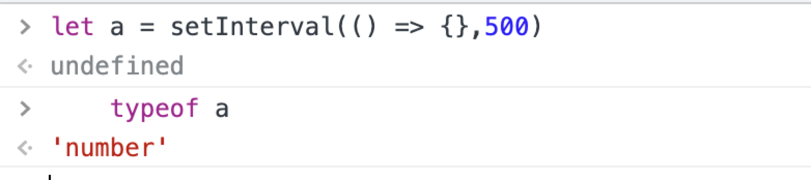

📮 订阅：https://rottenpen.zhubai.love/

嗨，朋友们，这里是 FE News 的第 7 期。

本来想在掘金上也发一下周报，被打回了，突然意识到在国内的平台是不允许情绪表达的，想了一下竹白再将来也未必靠谱，哪怕现在在某种角度来说它是推流的好帮手，还是要给 FE News 独立设一个网站。

一开始想用 vercel 的，毕竟它成熟且方便，但从另一方面想，成熟方便就不好玩了，我还想稍微折腾一下，就选了 deno，兴许还能混点 pr 什么的。

# 🙈 前端见闻

## 🧩 Deno

### web API

不光 deno 目前市面上其他的几个 js runtime 都是基于 web API 的。什么是基于 web API 呢？相信很多同学都遇到过这种情况，这个包是基于 web 开发的，拿到 node 端用各种报错，这个 api 有，那个 api 没有，或者各种历史遗留的规范问题 ⬇️ 。




如果有读者看过我前面的周报应该有了解到 Vercel 开源的 Edge runtime，Edge runtime 的核心用途就是让开发者在 node 环境里也能体验到开发 web API 的开发环境（这里明确一点，Edge runtime 是基于 v8 开发的）。

### Deno blog

极简的 blog 工具，只需一个简单的配置文件，就能快速生成网站。

```ts
// https://github.com/rottenpen/fe_news/blob/main/main.ts

blog({
  title: "FE News 周刊",
  author: "Rottenpen",
  avatar: "./goal.png",
  avatarClass: "full",
  links: [
    { title: "Email", url: "mailto:rottenpen@outlook.com" },
    { title: "GitHub", url: "https://github.com/rottenpen" },
  ],
  favicon: "./goal.png",
  middlewares: [
    ga("G-TJWE3KPNCT"),
    // redirects({
    //   "iocp-links.html": "iocp_links",
    //   "rant.html": "rant",
    // }),
  ],
});
```


https://fe-news.deno.dev/

### 如何通过 deno 在 rust 里创建一个 js runtime

📖 用 deno 制定你的 js runtime：https://deno.com/blog/roll-your-own-javascript-runtime

📖 以及为什么要制定你的 js runtime：https://linux-china.davao.page/blog/2022-07-31-deno-customization/
两篇一起食用，口味更佳。

## 🧩 微信小程序整了一个新活

在过去，微信小程序都是以双线程的架构设计的，其他友商在这方面的设计也都大同小异，最近微信新出了单线程模式，渲染层由 Skyline 引擎实现，原本在 Webview 侧执行的的 js 逻辑则放在 AppService 上的 vm 里执行，从而减小双线程通信的问题。

新架构有点和 flutter 的实现异曲同工，不过小程序的 template 使用起来肯定比 widget 舒服就是。

> Anyway 友商真有钱，这个架构落地都不知道要花多少人力物力了...看了一下目前安卓端和 pc 端已经支持这种模式了。


https://developers.weixin.qq.com/miniprogram/dev/framework/runtime/skyline/introduction.html


## 🧩 技术债的前世今生


https://www.maguangguang.xyz/tech-debt-quadrant

## 🧩 SQLite 背后的故事

> 但 SQLite 的代码非常底层，有时甚至需要深入到机器码这个层面去测试，测试难度相当高，要做到 100% 测试覆盖绝非易事。他们花了整整一年的时间，每天12小时，每周工作 60 小时做到了 95% 的覆盖率，另外剩余的 5% 更困难，花了更多的时间去做。据 Richard 自己说，这 5% 的测试代码从未开放过，它甚至想作为产品的核心功能拿去卖钱。有了 100% 测试覆盖率后，SQLite 在 Android 上就没再被客户报过 bug 了。

⬆️ 测试的重要性

https://liyafu.com/2022-07-31-sqlite-untold-story/


# 📦 资讯收集

## 🧩【事不过三】

以下摘自：[https://via.zhubai.love/posts/2165592566207815680](https://via.zhubai.love/posts/2165592566207815680)

创作中的 80 分策略，目的在于放弃完美心态。如何培养不完美心态？有个方法叫做叛逆练习。

所谓叛逆，指的是可以对社会期待说不，对同侪压力说不，对过去的生活方式说不，等等。

---

彭萦分享过一个成长公式：

> 一个人的成长=个人成长×公司成长×行业成长×国家成长。

> 前面都是小零头，后面才是大乘积。没有国家品牌哪来个人品牌，没有国家品牌哪来公司品牌。

## 🧩 人工智能艺术不是艺术

一些对人工智能艺术的批评。


> 这意味着在最坏的情况下，人工智能艺术取代了人类艺术的重要部分，将预示着一个世界的到来。在这个世界中，你看到的大部分 “艺术”，尤其是在线（大多数眼球所在的地方）都是由无意识的机器生成的。

让我想起，前阵子小红书看到有人卖 rick and morty 画风的画。我下意识在想是不是用 https://www.gorickyourself.com/ 捏脸捏出来的，那收几十块一个头像也太离谱了。


有没有可能在未来我们会下意识觉得，一些画是用人工智能生成的，所以大部分插画师失去他们的工作导致美术行业的凋零呢？（在考虑美术行业会不会凋零的同时，我们切图仔也岌岌可危就是...不过短期看起来美术的危险更大）

https://erikhoel.substack.com/p/ai-art-isnt-art

## 🧩 微软的低/无代码业务营收已突破20亿美金，成增长最快业务之一

https://mp.weixin.qq.com/s/YSTaQQywqYOIkiIRuCv4CA

## 🧩 snappify 生成好看代码片段贴图的工具

之前刷题群里有个月经贴，群主的代码截图是什么生成的（carbon），然而我发现一个更屌的⬇️，如果可以跟 slideV 或者飞书搭配就好了。

<video src="https://rdneegrwaqluqlbqohmj.supabase.in/storage/v1/object/public/assets/landingpage.mp4" autoplay loop muted playsinline></video>

https://snappify.io/

# 🚴 生活

- 🚀 最近事情并行太多了，下个双月不敢了，争取以后 8 9 点下班，到家可以写开源，写自己的代码

- 🚀 平平淡淡地度过了七夕，可惜平时常买的花店好像倒闭了，没买到花

- 🚀 我们组有 hc 了，我愿称之为海量，我们组倾向技术向的同学，主要业务方向是抖音生态下的开放能力，具体内容不限于小程序基础组件 api 设计（hybrid）/ pc端小程序（electron）/ 还有开放平台(react /vue + node bff)，外包也招，有兴趣的可以联系我哦

# 👋 最后

希望以后能保持周更吧！

对齐一下 Saka https://manjusaka.zhubai.love/

还有半月刊回忆 https://retros.zhubai.love/

Reach me: 🛰️pen1005

下周五见！
