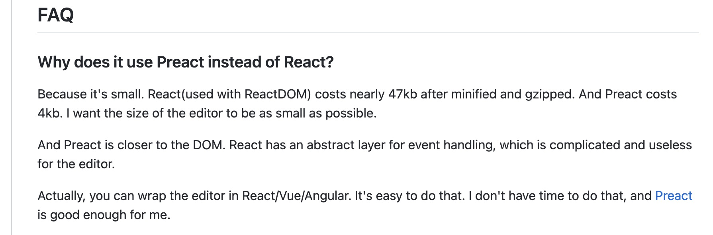
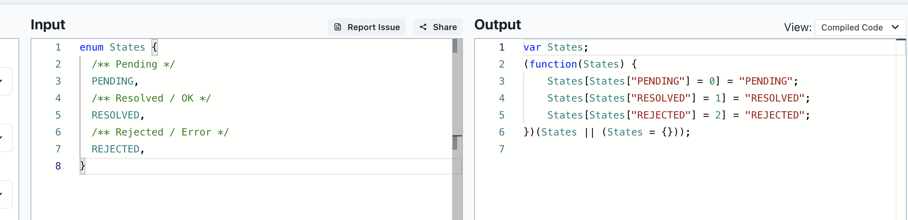
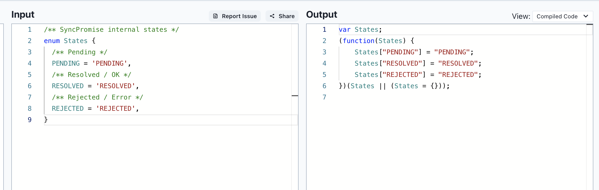
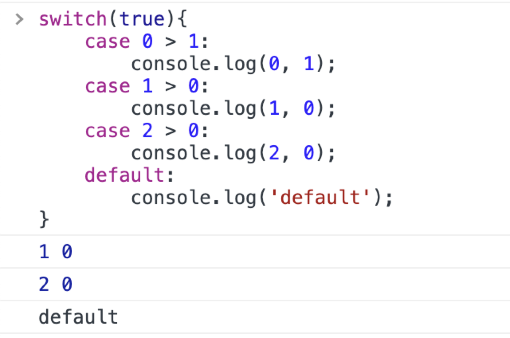
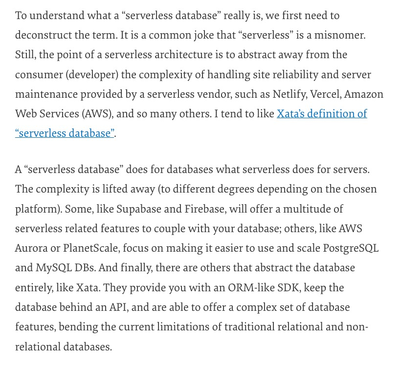
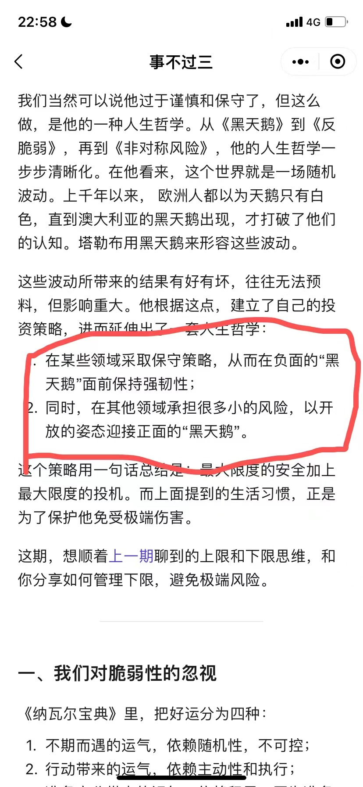

📮 订阅：https://rottenpen.zhubai.love/

嗨，朋友们，这里是 FE News 的第 8 期。

# 🙈 前端见闻

## 🧩 blocky-editor

发现一个类似 Notion block 形式开发的 editor。

FAQ 里一个解释挺有意思的，为什么不用 React 而用 Preact。因为希望包体积足够小，同时Preact 跟接近于 DOM，而且就算你想把它包装成 R/V/A 也很简单（因为它是 monorepo，core 和框架是分离的，core 实际是以 block 的形式组织的 vdom ）。



https://github.com/vincentdchan/blocky-editor

## 如何优化你 js 打包产物的性能

你猜以下两种写法，哪个打包产物小一点。

```ts
/** SyncPromise internal states */
enum States {
  /** Pending */
  PENDING,
  /** Resolved / OK */
  RESOLVED,
  /** Rejected / Error */
  REJECTED,
}
```
or
```ts
/** SyncPromise internal states */
enum States {
  /** Pending */
  PENDING = 'PENDING',
  /** Resolved / OK */
  RESOLVED = 'RESOLVED',
  /** Rejected / Error */
  REJECTED = 'REJECTED',
}
```

答案是第二种，因为如果不指定具体值，会默认填充递增的 value。





另外这周发现一个 switch 的另类写法（某种意义上这种写法性能高，可读性好像也不差？



https://blog.sentry.io/2022/07/22/performance-impact-of-generated-javascript

## 🧩 电子包浆


https://github.com/itorr/patina

## 🧩 Databend 的工程效率实践

https://xuanwo.io/reports/2022-31/

## 🧩 前端视角的 Serverless Database 和 Database DevOps



https://www.smashingmagazine.com/2022/08/databases-frontend-developers-rise-serverless-databases/

## 🧩 苏洋的《2022 年中总结》

> do what is right, not what is easy

很好看的年中总结！太鼓舞人心了。

https://soulteary.com/2022/08/01/2021-year-end-summary.html

# 📦 资讯收集

## 🧩 组织进化论 《遇到伪中层的生存指南》

这一期很有用！职场生存之道，强推！


## 🧩 2022雷军年度演


https://mp.weixin.qq.com/s/yIRFy8HL3RIx1Nul4jT4Aw

## 🧩 快手硬核ToB第一枪：视频能力对外开放，自研芯片首次曝光

https://mp.weixin.qq.com/s/dUQZqQoOFjXpW1_7MG9Z4w

# 🚴 生活

## 🚀 这周给 deno_std 以及 deno_blog 提了两个 pr

## 🚀 周末去死党家玩

🧩 跟死党家做饭阿姨唠嗑，她一直怂恿我赶紧买房，家里也不是给不起首付，不买以后肯定会后悔。

我的几个观点：

- 我不太确定自己能否一直保持现在的竞争力，我对中国经济，以及互联网一直是看衰的，不知道什么时候黑天鹅来了，高杠杆上岸，不是真的上岸，是岸上我，那时候我就没有退路了。
- 对于我的现状，我其实还有很多选择，在大厂卷只是其中一个，肉翻国外，小城市 remote 都是不错的选择。
- 杭州的房价配这个价钱吗？不太配吧。

> 总结就是：穷 买不起



## 🚀 见识了天花板级别的自我介绍

模版大概是：我的履历，我擅长的方向，我最牛逼的点，我可以给你带来什么。

⬆️ 学习的榜样。

## 🚀 小徐老师回家一趟，未来几天到家都空荡荡的了，呜呜呜

## 🚀 话说有同学想跟我一起摸一波 typo 级别的 bugfix 吗（背景是我最近想修一大波 Taro 在字节小程序的 bug 和 typing ，但是又比较容易混 pr 的）

# 👋 最后

希望以后能保持周更吧！

对齐一下 Saka https://manjusaka.zhubai.love/

还有半月刊回忆 https://retros.zhubai.love/

Reach me: 🛰️pen1005

下周五见！
