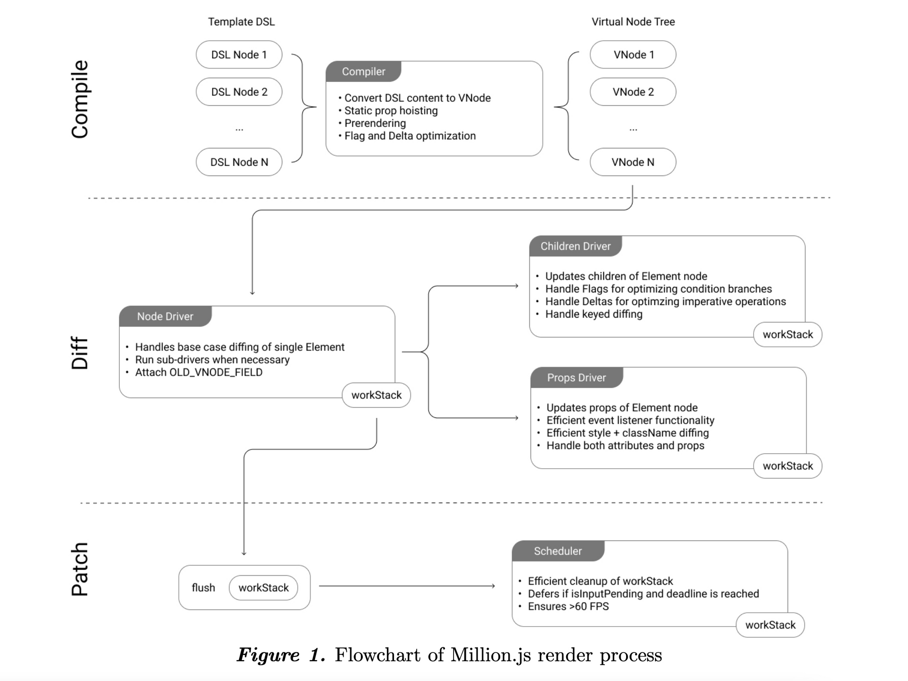

📮 订阅：https://rottenpen.zhubai.love/

> 在第一期周刊里我们有聊到 MillionJS 这个 vdom 库，这是一个详细版的解析

# 前言

最近发现一个新兴的 v-dom 库，它高效且轻量，是由一个 17 岁的 vercel 实习生实现。该库也得到了 vercel 的赞助。目前该仓库已经有 2k+ 的 star 了。

# 基本用法
为了便于大家理解它是做什么的，先介绍一下它暴露的两个基本用法。

## m()
使用 m 可以创建一个 Vnode

### Syntax:

`m(tag, props?, children?, flag?, delta?, hook?)`

### Example:

```js
import { m } from 'million';

const vnode = m('div', { id: 'app' }, ['Hello World'])
```
```js
{  
	tag: 'div',  
	props: {},  
	children: ['Hello World'],  
	key: 'foo',
}
```
## 参数


# 那到底为什么这么快呢？
大家可以可以通过 million 官网可以测出，million 的速度在很多情况下都是 **snabbdom** 三倍以上。


> operations/second 表示一秒钟内可以进行多少次相同的操作，像上图为一秒该vdom可以完成多少次 append many rows to large table

## 这个 benchmarks 是怎么统计的？
为了达到以上 BenchMark 的表现，它具体做了哪些优化呢?（ps. millionJS 的编译过程由 million 提供的 jsx-runtime 模块进行，最终获取 vnode。所以这中间会有点 ”猫腻”，其他 Vdom 库没法利用 flag 跟 delta 进行优化 patch 效率。当然其他仓库也许也能提供一个对自己比较有利的 runtime 来提高自己的比分。对 benchmarks 感兴趣的同学可参考 https://github.com/aidenybai/million/tree/main/benchmarks

由此我们可以先下一个简单的结论：和其他 virtual DOM 库相比，Million.js 集成了编译器的优化特点，减少了不必要的 diffing。基于这些特性，Million.js 在正确优化时，dom diff 的时间复杂度可以优化到 O(1) ，而其他虚拟 dom 库大部分都是 O(n)

在某些情况下，尤其是在 benchmarks 中，对 DOM 的操作是简单且可预测的。对这种情况进行区分是不必要的工作，这就是为什么 Million.js 支持称为 deltas 的概念，它提供了一个编程 API，用于对 DOM 应用确定性、命令式修改。


## 编译阶段（compiler）
相信大家都了解，无论是 vue 还是 react 还是我们小程序底层用的 yaw 都需要经历一个由 DSL 转化为 Vnode 的过程，它在我们代码的表现可能是 vue template 可能是 jsx 可能是 ttml。million 为编译层提供了 patchFlag 和 delta 用于优化编译流程。

### Flag

如果了解 vue3 编译优化的同学应该对 flag 不陌生，通过 flag 可以在 patch 阶段，对 dom diff 进行优化。它的主要处理逻辑是：跳过静态内容，只对比动态内容

```ts
enum Flags {
  ELEMENT, // 正常节点，默认值
  ELEMENT_IGNORE, // 无视当前节点
  ELEMENT_FORCE_UPDATE, // 强制更新 vdom
  ELEMENT_SKIP_DRIVERS, // 跳过
  ELEMENT_NO_CHILDREN, // 当前节点没有子节点
  ELEMENT_TEXT_CHILDREN, // 只是修改字段
  ELEMENT_KEYED_CHILDREN, // 已经标记 key 了，可通过 key 来优化
  ELEMENT_THUNK,// memoize 的节点，避免被 patch
}
```

### vue3 的 patchFlag


### million 的 patchFlag


### Delta

通过 Delta 可以为节点标注第几个子节点支持什么方法（Insert/update/delete），例如:


JSX 里的用法是这样⬇️：


只需要在 table 上注明 delta，就可以跳过 dom diff 直接快进到 remove 第 row 行这一步了。在这种 case 上实现 O(n) ⇒ O(1)

除了生成这两个 Vnode 优化属性，编译阶段，它还提供了类似于 vue3 的预渲染和静态提升

- 预渲染
  - 对于一些不会被修改的静态节点，预渲染
- 静态提升
  - 对于一些被重复调用相同阶段，提升到顶层，实现节点复用

## 对比阶段 (diff)
有了编译阶段中 flag 和 delta 的加成，diff 阶段就能得到很好的优化，甚至在一些 case 中实现直接跳过 diff 阶段，直接进行 dom 操作。

## 补丁阶段 (patch)
patch 过程中，million 设计了 Scheduler 来优化，patch 过程中的用户性能体验，如果主线程受阻，patch 可以推迟进行，从而缓解 "页面冻结 "的情况。

Scheduler 的设计也比较简单，直接使用 window.requestIdleCallback 。相信对 React 了解的同学都不会陌生。


# 总结

总的来说，millionJS 是一个重编译的库，它通过提供的 jsx runtime 把 DSL 代码转化为做好标记的 Vnode。让编译过程可以跳过不少不要的 dom diff，从而把原本 O(n) 的时间复杂度降低到 O(1)：

编译阶段实现了静态提升，预渲染，以及生成 flag 和 delta
diff 阶段，通过 delta 预测下一步的操作是 insert，update 还是 remove，通过 flag 跳过不必要的 dom diff
patch 阶段实现调度器，保证渲染效果 fps 达到 60/ms 以上
它同时保留了，重编译带来的好处，又保留了 vdom 本身的优势（容易抽象，低成本 ssr）。

不过对于编译优化，我是存疑的，现在给出来的 dsl 都是 jsx，和相对来说比较好预测的 template 相比，jsx 是灵活且难以预测的，所以开发者必须自己手动给节点注释 delta 来规避 patch，如何优雅地把这些注释隐藏起来，也是一个很大的学问。
